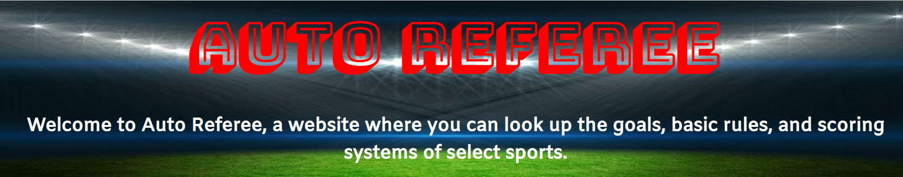

# The-Binary-Trio
UCB Coding First Group Project

Our project, Auto-Referee, is a webpage that helps its users understand the rules of the sport they are watching or want to play. Our page has three main parts: a header, a gallery, and the desciption area where one can learn about the different rules of a given sport. 

The header has the title and a brief description of the page. It also has a list of teams, that when one is selected, the team's players are listed. 

The gallery is an array of tiles that will display a sport's information or hide it when clicked on (this is done with a toggle function). 

Each section of sports' information has buttons on the left hand side named Goals, Basics, and Scoring, referring to each section of information for each sport. These buttons also toggle the sections in question, and so each section will appear or disappear depending on their toggle status.  
